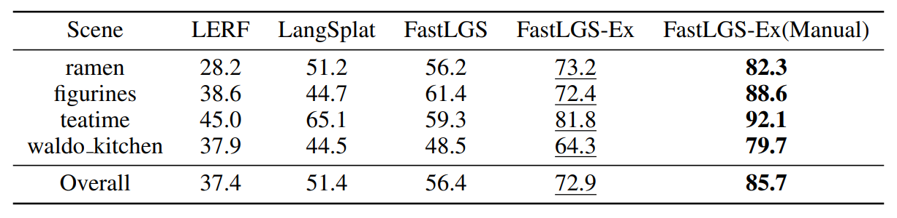
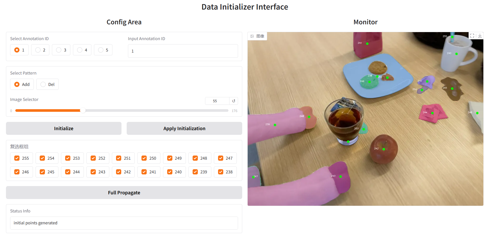
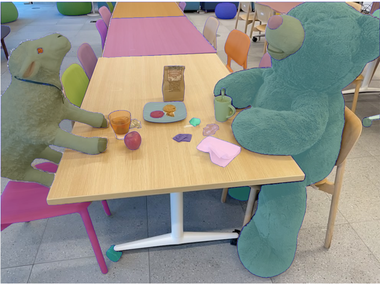

# FastLGS-Ex
This is simplified implementation of extending FastLGS with [SAM2](https://github.com/facebookresearch/sam2).

SAM2 shows astonishing consistency and efficiency in video segmentation, thus we use it to replace the original matching part.

The original matching preprocess is time-consuming that costs more than 25 minutes, but with SAM2 it can be done within 2 minutes.

We further provide a GUI for manual refinement.

MIoU Results on the [LERF_OVS](https://drive.google.com/file/d/1QF1Po5p5DwTjFHu6tnTeYs_G0egMVmHt/view) dataset are as follows:



# Envs
The base env is provided in fastlgs_base_env.yml: 

```
conda env create --file fastlgs_base_env.yml
conda activate fastlgs
```

Please follow the [instructions](https://github.com/facebookresearch/sam2) to install SAM2.

GUI is based on Gradio:

```
pip install gradio
```

Raw pip dependencies are in requirements.txt.

# Using GUI

### 0. Setting Paths
Check code/Data_Init_GUI.py to set all required paths.
### 1. Launch GUI
If your gradio is installed correctly, after `python Data_Init_GUI.py` you can access to GUI interface in browser.
### 2. Detailed Usage
You may choose the initial frame by draging the bar.

After pressing "Initialize" you can see the auto-generated point prompts and you can deselect unwanted points.

Then press "Apply Initialization" you would see the first frame masks.

If certain masks are degraded, you can add two types of manual prompts by clicking on the image. Be sure to set the right prompt id before clicking.

You can also skip the whole initialization part and click anything yourself. 

At last press "Full Propagate" to propagate the current masks to all other frames, and the mapped features will be saved to pre-set paths.

*FastLGS-Ex results shown above is based on auto initialization without manual prompts, FastLGS-Ex(Manual) means auto initialization plus manual prompts.

# Enrich Features (Experimental & Optional)
While a single object's features vary with view change, using only the features of single initial view can lead to failure in demanding scenarios. 

code/update_mapping.py shows a example of enriching multi-view semantics, but could cause surrounding information to override original features, thus it is not used in evaluation.

# Training Features
You can use any 3DGS method to train the generated feature maps, thus this part is not integrated in this simplified version.

The original 3DGS is a quick approach, please refer to its [instructions](https://github.com/graphdeco-inria/gaussian-splatting).

# Evaluate
After training and rendering features, you can use the example code/query_target.py to query scene objects.

We also provide the evaluation code used in LERF_OVS dataset: code/evaluate_lerf_ovs.py.

Please refer to the code for detailed usage.

*Note that the auto mask generation can vary upon different settings, the results of official SAM2 auto mask generation demo (with default config) on our setting are:


## Bibtex
If you find this useful, please cite the paper!
<pre id="codecell0">@inproceedings{ji2025fastlgs,
&nbsp;author = {Ji, Yuzhou and Zhu, He and Tang, Junshu and Liu, Wuyi and Zhang, Zhizhong and Tan, Xin and Xie, Yuan},
&nbsp;title = {FastLGS: Speeding up Language Embedded Gaussians with Feature Grid Mapping},
&nbsp;booktitle = {Proceedings of the AAAI Conference on Artificial Intelligence},
&nbsp;year = {2025},
} </pre>
